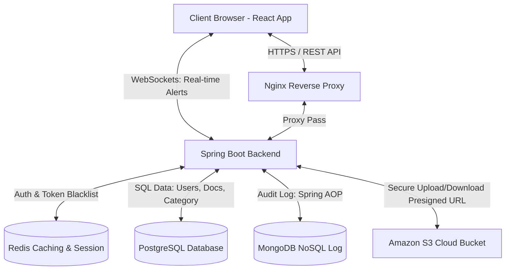
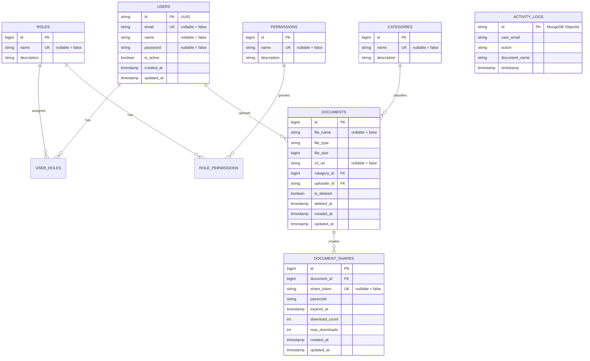

# 🏢 Enterprise Document Hub (Hệ Thống Quản Lý Tài Liệu Doanh Nghiệp)

<!-- Badges -->
<div align="left">
  
  
  
  
  
  
  
  
</div>

---

## 📖 Giới Thiệu Dự Án
**Enterprise Document Hub** là một hệ thống quản lý và chia sẻ tài liệu nội bộ cấp doanh nghiệp chuyên nghiệp. Dự án được thiết kế theo mô hình kiến trúc cơ sở dữ liệu kết hợp (**Hybrid Database**) giữa SQL (PostgreSQL) và NoSQL (MongoDB), tích hợp dịch vụ lưu trữ đám mây AWS S3, cơ chế Caching/Blacklist bằng Redis, kênh truyền thông tải tin thời gian thực **WebSockets** và giao diện người dùng tối giản hiện đại (hỗ trợ Light/Dark Mode theo phong cách Vercel/Linear).

Dự án được tối ưu và thiết kế để giải quyết các bài toán thực tế trong môi trường doanh nghiệp:
1. **Lưu trữ tài liệu bảo mật & phi tập trung:** Liên kết trực tiếp với dịch vụ AWS S3 lưu trữ nhị phân, ẩn đường dẫn thật bằng cơ chế Presigned URL.
2. **Quản lý phân quyền chặt chẽ (RBAC):** Phân quyền người dùng chi tiết tới từng API endpoint dựa trên JWT Token và Spring Security.
3. **Audit Log hiệu năng cao:** Sử dụng AOP (Aspect-Oriented Programming) ghi nhận lịch sử tương tác bất đồng bộ trực tiếp vào MongoDB để giảm tải cho database chính.
4. **Chia sẻ file nâng cao:** Hỗ trợ tạo liên kết tải file công khai có mật khẩu bảo vệ (passcode), giới hạn lượt tải, thời gian hết hạn và quản lý/thu hồi link chia sẻ linh hoạt.
5. **Thông báo thời gian thực (Real-time Alert):** Tự động phát thông báo tới chủ sở hữu qua kết nối WebSockets ngay khi có người khác tải file qua link chia sẻ của họ.
6. **Thùng rác & khôi phục (Trash Bin):** Hỗ trợ cơ chế xóa tạm thời (Soft Delete), phục hồi và xóa vĩnh viễn (Hard Delete khỏi DB & AWS S3).


---

## 🛠️ Công Nghệ & Kiến Trúc Hệ Thống

### 1. Tech Stack
*   **Backend:** Java 17, Spring Boot 3.x, Spring Data JPA, Spring Security (OAuth2 Resource Server JWT), Spring AOP (AspectJ), Spring WebSockets, MapStruct, Lombok.
*   **Frontend:** React JS 19 (Vite), Custom CSS (Vercel-like dark UI / Light Mode compatible), Lucide Icons, Context API.
*   **Databases & Caching:**
    *   **PostgreSQL (Relational):** Lưu trữ dữ liệu cấu trúc có tính toàn vẹn cao: `User`, `Role`, `Permission`, `Category`, `Document`, `DocumentShare`.
    *   **MongoDB (NoSQL):** Lưu trữ dữ liệu log hoạt động phi cấu trúc (`ActivityLog`), đảm bảo tốc độ ghi nhanh và khả năng mở rộng tốt.
    *   **Redis:** Quản lý JWT Blacklist (khi logout) và lưu trữ Refresh Token để phục vụ cơ chế Token Rotation.
*   **Cloud Infrastructure:** AWS S3 (Simple Storage Service) để lưu trữ file an toàn, tránh phình to ổ cứng Server.
*   **Containerization & Proxy:** Docker, Docker Compose, Nginx.

---

### 2. Sơ Đồ Kiến Trúc Hệ Thống (System Architecture)

Dưới đây là mô hình hoạt động và luồng trao đổi dữ liệu giữa các thành phần của hệ thống:



---

## 💾 Thiết Kế Cơ Sở Dữ Liệu (Database Schema)

Dự án áp dụng mô hình kết hợp giữa SQL và NoSQL:



---

## ⚡ Các Tính Năng Nghiệp Vụ Cốt Lõi

### 🔑 1. Hệ Thống Xác Thực & Phân Quyền (RBAC)
*   **Xác thực không trạng thái (Stateless Auth):** Sử dụng JSON Web Token (JWT) được ký bằng thuật toán HS512.
*   **Redis Token Blacklisting & Refresh Rotation:** 
    *   Hỗ trợ `Access Token` thời hạn ngắn và `Refresh Token` thời hạn dài.
    *   Khi người dùng Logout, Access Token cũ bị đưa vào blacklist lưu trên Redis tương ứng với thời gian sống còn lại của Token để chống tấn công phát lại (Replay Attacks).
*   **Phân quyền dựa trên Role & Permission (RBAC):** Cấu hình chặt chẽ sử dụng `@PreAuthorize` ở Controller. Ví dụ: Chỉ tài khoản có Role `ADMIN` mới được phép thao tác CRUD Category, CRUD Role, và quản lý người dùng.

### 📂 2. Quản Lý Tài Liệu Với AWS S3
*   **Lưu trữ đám mây Private:** Tài liệu tải lên được gửi trực tiếp lên AWS S3 dưới dạng file private (không thể truy cập công khai trực tiếp).
*   **Sử dụng Presigned URL:** Khi người dùng muốn tải xuống file, hệ thống sẽ sinh ra một URL truy cập tạm thời có hiệu lực tối đa trong 10 phút. Đảm bảo file được bảo vệ tối đa và không bị lộ đường dẫn thực tế.
*   **Phân loại theo danh mục (Category):** Tổ chức dữ liệu thông minh theo từng thư mục/nhóm danh mục để dễ quản lý.

### 🗑️ 3. Thùng Rác (Trash Bin - Soft Delete & Restore)
*   **Xóa tạm thời (Soft Delete):** Xóa tài liệu mà không thực sự mất file. Hệ thống gán cờ `isDeleted = true` và ghi nhận thời gian xóa `deletedAt`. Tài liệu bị ẩn khỏi Dashboard chính.
*   **Khôi phục tài liệu (Restore):** Khôi phục tài liệu đã xóa tạm thời về lại Dashboard chỉ với 1 click.
*   **Xóa vĩnh viễn (Hard Delete):** Xóa bản ghi trong PostgreSQL và thực hiện gọi AWS S3 SDK xóa trực tiếp vật thể nhị phân trên Bucket của AWS, giải phóng hoàn toàn dung lượng lưu trữ.

### 🔗 4. Quản Lý Chia Sẻ Tài Liệu Nâng Cao (Advanced Share Link)
*   **Sinh mã token độc nhất:** Link chia sẻ được gán mã Token ngẫu nhiên (UUID/String) độc bản.
*   **Tính năng bảo mật nâng cao:**
    *   **Mật khẩu bảo vệ (Passcode):** Khách truy cập bắt buộc phải nhập đúng Passcode được đặt bởi người chia sẻ để lấy link tải.
    *   **Hạn dùng link (Expired Date):** Hỗ trợ chọn nhanh thời hạn hết hạn (`+1 giờ`, `+1 ngày`, `+7 ngày`, `Vô hạn`) giúp cải thiện UX tối đa.
    *   **Giới hạn số lần tải tối đa (Max Downloads):** Link tự động đóng khi đạt đủ số lượt download cấu hình.
*   **Xem & Thu hồi link:** Giao diện quản lý hiển thị đầy đủ thông số hoạt động của các link hiện tại (lượt tải thực tế, hạn dùng, mật mã) và cho phép **Thu hồi (xóa)** link tức thời.
*   **Khách tải file công khai:** Cho phép người dùng không có tài khoản tải tài liệu qua API `/shares/{token}/download` sau khi vượt qua các bước xác thực điều kiện trên.

### 🔔 5. Thông Báo Thời Gian Thực (Real-time WebSockets)
*   Khi có người dùng (kể cả khách vãng lai) tải file qua link chia sẻ công khai, Backend sẽ tự động xác định email của Uploader và đẩy một thông báo thời gian thực qua kênh WebSockets.
*   Frontend lắng nghe và hiển thị một Toast Alert màu xanh dương trượt nhẹ nhàng ở góc màn hình để báo hiệu cho Uploader biết tài liệu của họ vừa có lượt tải mới.

### 📝 6. Giám Sát Hoạt Động Hệ Thống (AOP Audit Logging)
*   Áp dụng kỹ thuật **Spring AOP (Aspect Oriented Programming)** với Aspect `ActivityLogAspect` để tự động bắt và ghi nhận log các sự kiện quan trọng (`UPLOAD_DOCUMENT`, `DOWNLOAD_DOCUMENT`, `DELETE_DOCUMENT`).
*   Giúp tách biệt code nghiệp vụ (Business Logic) và code giám sát (Logging), giúp mã nguồn sạch sẽ (`Clean Code`).
*   Toàn bộ log được lưu trữ bất đồng bộ vào **MongoDB** nhằm giải phóng tải tác vụ cho cơ sở dữ liệu PostgreSQL.

### 🎨 7. Trải Nghiệm Người Dùng Tinh Tế (UX/UI Polish)
*   **Hộp thoại xác nhận tùy biến (Custom Confirm Modal Context):** Loại bỏ hoàn toàn các hàm `window.confirm` và `alert` mặc định thô sơ của trình duyệt. Thay thế bằng Confirm Dialog mượt mà sử dụng React Context, thiết kế glassmorphic hiện đại kết hợp hoạt cảnh chuyển động tinh tế (`scale-up`, `fade-in`).
*   **Chế độ Sáng / Tối (Light & Dark Theme Switcher):** Cho phép chuyển đổi nhanh giao diện sáng hoặc tối chỉ bằng một click chuột, lưu tùy chọn trong `localStorage` để tự động khôi phục giao diện ở lần truy cập tiếp theo.

---

## 📂 Cấu Trúc Thư Mục Dự Án (Project Structure)

```text
document-hub/
├── docker-compose.yml          # Quản lý PG, Mongo, Redis, App, Nginx
├── .env                        # Chứa cấu hình bảo mật môi trường phát triển
├── backend/                    # --- MÃ NGUỒN BACKEND (SPRING BOOT) ---
│   ├── src/main/java/backend/example/backend/
│   │   ├── common/             # Chứa base entity, exception & format response chung, GlobalExceptionHandler
│   │   ├── config/             # Cấu hình Security, AWS S3, JWT, WebSockets, Database Init
│   │   └── modules/            # Các Module nghiệp vụ chính
│   │       ├── auth/           # Đăng nhập, đăng ký, refresh, blacklist token
│   │       ├── user/           # Quản lý User, Role, Permission (RBAC)
│   │       ├── document/       # CRUD Document, Danh mục (Category), S3 Storage Service, share link management
│   │       └── log/            # AOP Activity Logging (MongoDB)
│   ├── src/main/resources/
│   │   └── application.yml     # File cấu hình database, cổng, JWT & AWS
│   └── pom.xml                 # Khai báo thư viện & cấu hình maven build
├── frontend/                   # --- MÃ NGUỒN FRONTEND (REACT JS) ---
│   ├── src/
│   │   ├── assets/             # Logo, icon, font hình ảnh
│   │   ├── context/            # AuthContext quản lý session, ConfirmContext quản lý hộp thoại confirm
│   │   ├── pages/              # Giao diện (Auth, Dashboard, Category, Trash, ShareView)
│   │   ├── services/           # Axios Interceptor giao tiếp backend, tự động gửi Token
│   │   ├── App.jsx             # File điều hướng Router & quản lý theme
│   │   ├── index.css           # Design system, tùy chỉnh CSS (Dark/Light mode Vercel)
│   │   └── main.jsx            # Điểm khởi chạy React
│   └── package.json            # Quản lý thư viện frontend
```

---

## ⚙️ Hướng Dẫn Cài Đặt & Khởi Chạy Nhanh

### 1. Chuẩn Bị Trước
*   Cài đặt sẵn **Java 17** hoặc **21**.
*   Cài đặt sẵn **Node.js (v18+)** và **npm**.
*   Cài đặt **Docker & Docker Compose**.
*   Có tài khoản **AWS** hoạt động và 1 **Bucket S3** được cấu hình chế độ Private Access.

### 2. Cấu Hình Biến Môi Trường (`.env`)
Tạo file `.env` tại thư mục gốc của dự án (`/document-hub/.env`) và điền các thông số thích hợp:

```env
# --- DATABASE CREDENTIALS ---
DB_USER=postgres_admin
DB_PASSWORD=super_secret_pg_password
DB_NAME=document_hub_db

# --- SPRING BOOT ENVIRONMENT ---
PORT=8080
DB_URL=jdbc:postgresql://localhost:5433/document_hub_db
DB_DRIVER_CLASS=org.postgresql.Driver
DDL_AUTO=update
SHOW_SQL=true
FORMAT_SQL=true
DATABASE_PLATFORM=org.hibernate.dialect.PostgreSQLDialect
MONGO_URL=mongodb://localhost:27017/document_hub_logs

# --- AWS S3 CREDENTIALS ---
BUCKET_NAME=tên_bucket_của_bạn
ACCESS_KEY=aws_access_key_của_bạn
SECRET_KEY=aws_secret_key_của_bạn
AWS_REGION=vùng_s3_của_bạn (ví dụ: ap-southeast-1)
```

> [!WARNING]
> Không chia sẻ file `.env` lên GitHub hoặc các nền tảng public. Đây là thông tin bảo mật tuyệt đối về cơ sở dữ liệu và đám mây của bạn.

---

### 3. Khởi Chạy Hạ Tầng Cơ Sở Dữ Liệu
Chạy lệnh sau tại thư mục gốc để khởi động PostgreSQL, MongoDB và Redis qua Docker:

```bash
docker compose up -d
```

Kiểm tra trạng thái các container bằng lệnh `docker ps` để đảm bảo:
*   PostgreSQL đang chạy cổng `5433` (được mapping từ cổng gốc `5432` trong container)
*   MongoDB đang chạy cổng `27017`
*   Redis đang chạy cổng `6380`

---

### 4. Chạy Backend (Spring Boot)
Mở cửa sổ terminal mới, di chuyển vào thư mục `backend` và chạy lệnh:

```bash
cd backend
# Chạy dự án qua Maven Wrapper
./mvnw.cmd spring-boot:run
```
*   Server backend sẽ chạy tại: `http://localhost:8080`
*   Mã nguồn tự động khởi tạo dữ liệu mặc định ban đầu thông qua `DataInitializer.java` (gồm Role Admin/User và các phân quyền mẫu).

---

### 5. Chạy Frontend (React + Vite)
Mở cửa sổ terminal mới, di chuyển vào thư mục `frontend` và chạy:

```bash
cd frontend
# Cài đặt thư viện
npm install
# Khởi chạy môi trường local dev
npm run dev
```
*   Giao diện người dùng sẽ chạy tại: `http://localhost:5173`

---

## 🌐 Danh Sách API Endpoints Chính

| Module | Phương Thức | Endpoint | Yêu Cầu Phân Quyền | Mô Tả |
| :--- | :--- | :--- | :--- | :--- |
| **Auth** | `POST` | `/auth/login` | Công khai | Đăng nhập tài khoản, trả về JWT Token |
| | `POST` | `/auth/refresh` | Công khai | Làm mới Access Token thông qua Refresh Token |
| | `POST` | `/auth/logout` | Đã đăng nhập | Đăng xuất, đưa token hiện tại vào blacklist Redis |
| **User** | `POST` | `/users/create` | Công khai | Đăng ký tài khoản mới |
| | `GET` | `/users/my-info` | Đã đăng nhập | Xem thông tin tài khoản đang đăng nhập |
| | `GET` | `/users` | `Role: ADMIN` | Xem danh sách tất cả các người dùng hệ thống |
| **Doc** | `POST` | `/documents/upload`| Đã đăng nhập | Tải file lên hệ thống, đẩy thẳng lên AWS S3 |
| | `GET` | `/documents` | Đã đăng nhập | Xem danh sách file của hệ thống (hỗ trợ phân trang) |
| | `GET` | `/documents/{id}/download` | Đã đăng nhập | Sinh presigned url tải file (hiệu lực 10 phút) |
| | `DELETE`| `/documents/{id}` | Đã đăng nhập | Xóa tạm thời tài liệu (chuyển vào thùng rác) |
| **Trash**| `GET` | `/documents/trash` | Đã đăng nhập | Xem danh sách tài liệu trong thùng rác |
| | `PUT` | `/documents/{id}/restore`| Đã đăng nhập | Khôi phục tài liệu đã xóa tạm thời |
| | `DELETE`| `/documents/{id}/permanent`| Đã đăng nhập | Xóa vĩnh viễn tài liệu khỏi DB & AWS S3 |
| **Category**| `POST` | `/categories` | `Role: ADMIN` | Tạo danh mục phân loại mới |
| | `GET` | `/categories` | Đã đăng nhập | Xem danh sách tất cả các danh mục |
| **Share**| `POST` | `/documents/{id}/share`| Đã đăng nhập | Tạo liên kết chia sẻ (cấu hình passcode, hạn dùng...) |
| | `GET` | `/documents/{id}/shares`| Đã đăng nhập | Lấy danh sách các liên kết chia sẻ của tài liệu |
| | `DELETE`| `/shares/{token}`| Đã đăng nhập | Thu hồi (hủy) hiệu lực link chia sẻ |
| | `POST` | `/shares/{token}/download`| Công khai | Tải file được chia sẻ (kiểm tra passcode & hạn dùng) |

---

## 🔒 Các Điểm Cộng Bảo Mật & Kỹ Thuật Lớn Trên CV
Nếu bạn dùng dự án này để ứng tuyển, hãy nhấn mạnh các khía cạnh kỹ thuật sau với nhà tuyển dụng:
1.  **Cơ chế Stateless Security:** Xử lý toàn bộ bằng JWT, không lưu Session trên Ram của Server, dễ dàng scale-out server sau này.
2.  **Chống rò rỉ liên kết tải:** Ẩn toàn bộ url gốc của AWS S3. Thay vào đó sử dụng S3 Presigned URL có thời gian sống giới hạn.
3.  **Blacklist Token bằng Redis:** Giải quyết nhược điểm của JWT stateless (không thể thu hồi token trước hạn) bằng cách ghi nhận blacklist trên RAM nhanh Redis.
4.  **Tách biệt Cơ sở dữ liệu Log:** Không lưu log hoạt động vào PostgreSQL để tránh hiện tượng ghi đè ghi khóa ổ đĩa (I/O block), đẩy bất đồng bộ thông qua AOP Aspect vào MongoDB.
5.  **An toàn Thùng rác:** Soft Delete để tránh thảm họa mất dữ liệu do sơ ý từ người dùng, đồng thời tối ưu bộ nhớ đám mây khi thực hiện Hard Delete (xóa cả S3 Object).
6.  **Tránh lỗi Signature Mismatch do Tên File Chứa Khoảng Trắng:** Thiết kế hệ thống URL-decoding chuẩn chỉ cho S3 Key trước khi gọi API đám mây, triệt tiêu lỗi `NoSuchKey` phổ biến.
7.  **Kết nối WebSockets & Session Management:** Triển khai quản lý phiên kết nối WebSocket đồng bộ hóa theo tài khoản định danh người dùng (`WebSocketSessionManager`), giúp truyền tải thông báo thời gian thực hiệu suất cao.
8.  **Global Exception Handling:** Xây dựng cơ chế xử lý ngoại lệ tập trung (`@RestControllerAdvice`), bảo mật thông tin nội bộ của máy chủ và trả về chuẩn API Response thân thiện cho client.
